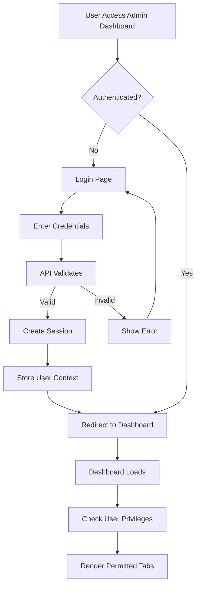
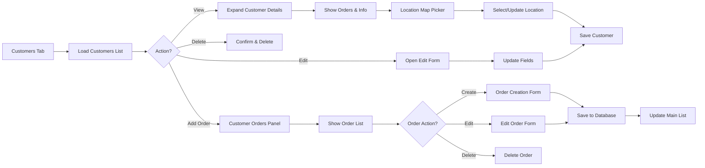
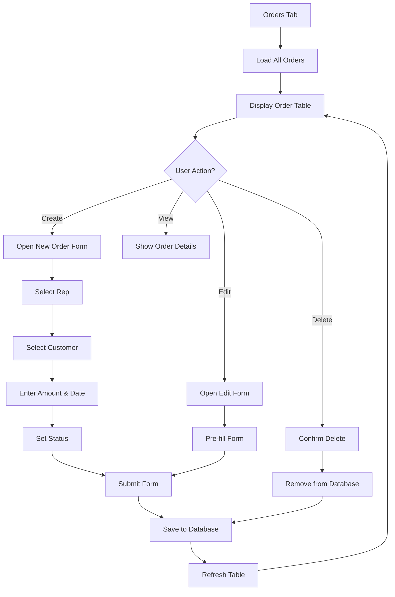
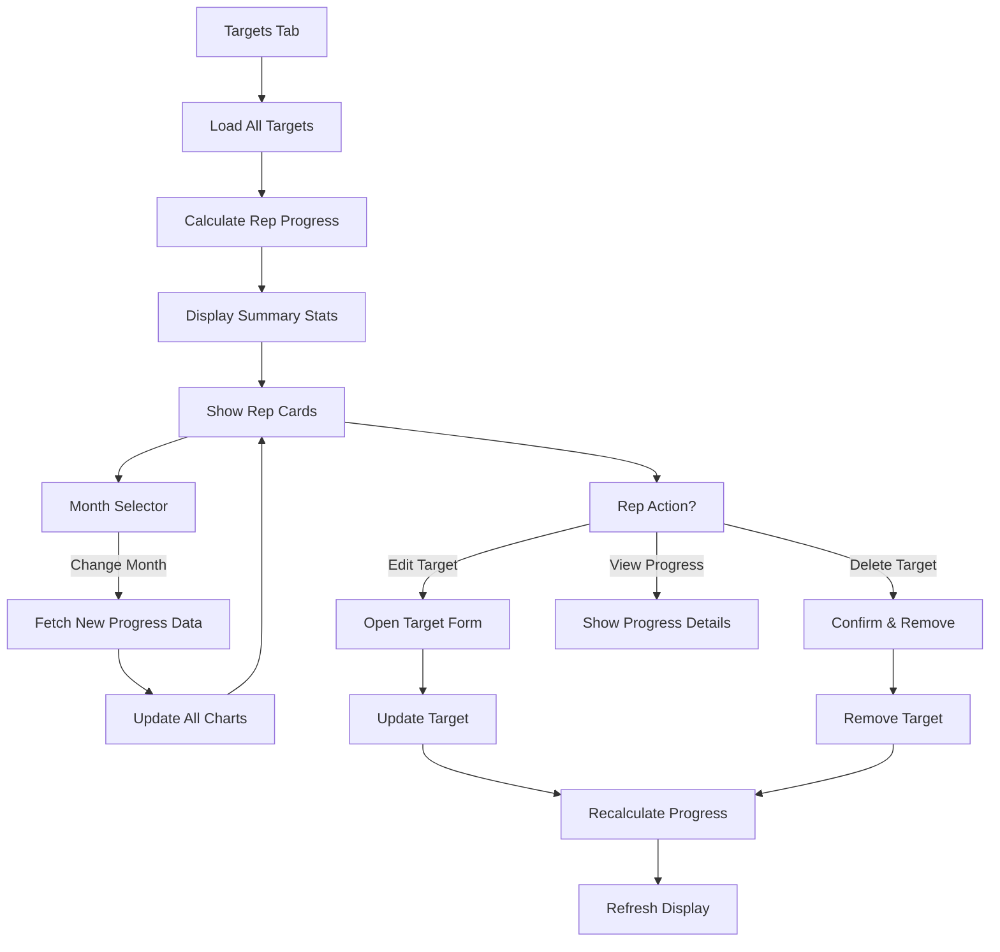
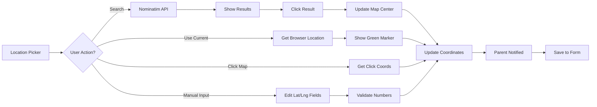
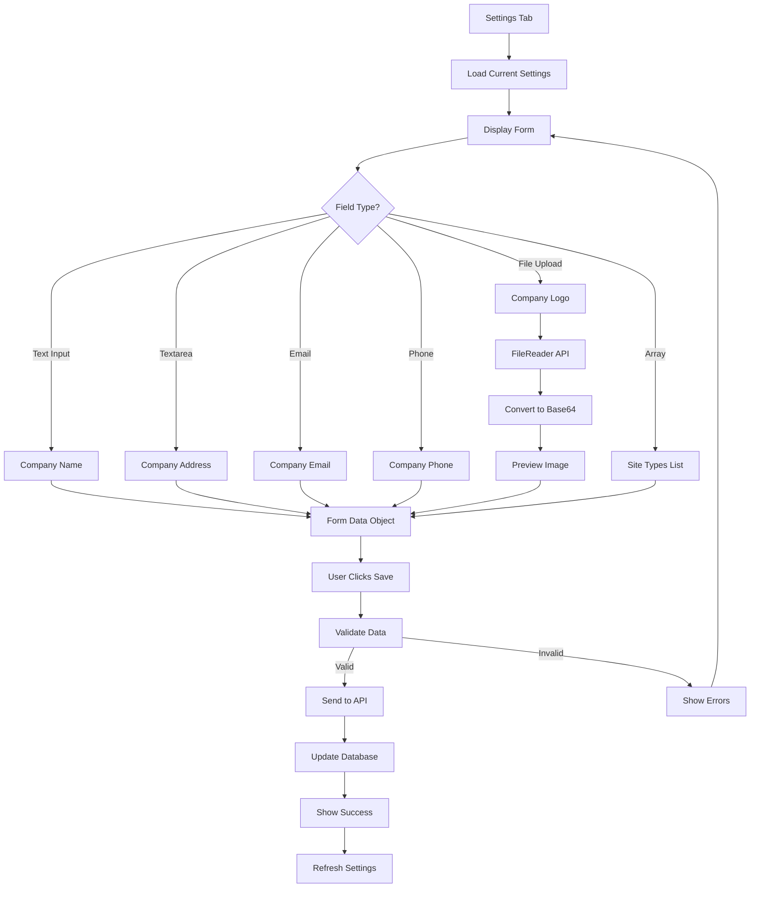
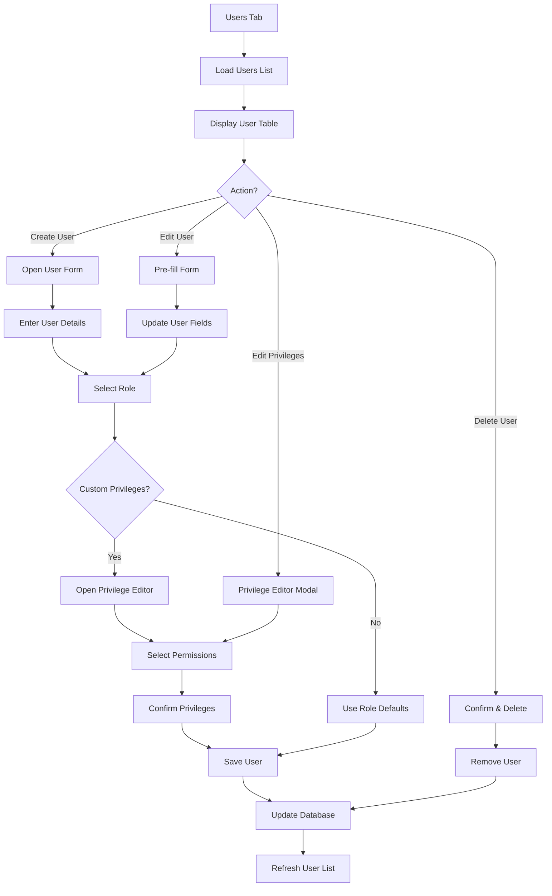
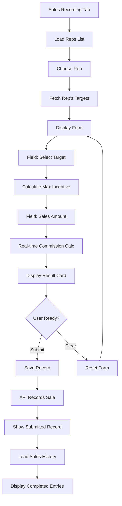
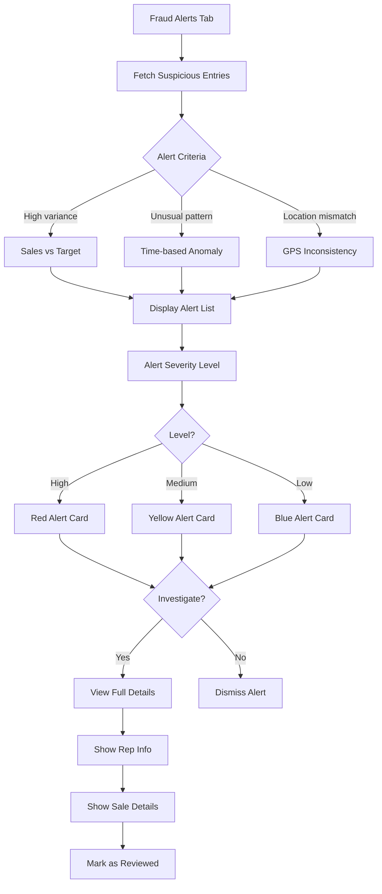
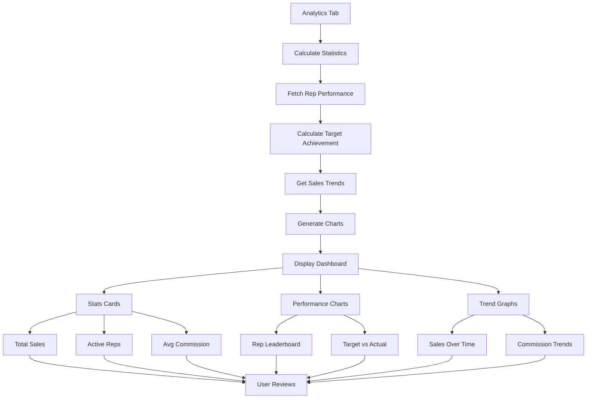

# QuarryForce Admin Dashboard - User Flow Diagrams

## 1. Authentication & Login Flow



## 2. Customer Management Flow



## 3. Order Management Flow



## 4. Target Management & Progress Flow



## 5. Location Selection Flow



## 6. Settings & Configuration Flow



## 7. User & Role Management Flow



## 8. Sales Recording Flow



## 9. Fraud Alerts Detection Flow



## 10. Analytics & Reports Flow



---

## Quick Reference: Component State Management

### State Patterns Used

#### Pattern 1: Basic CRUD Operations

```javascript
const [items, setItems] = useState([]);
const [loading, setLoading] = useState(true);
const [error, setError] = useState(null);
const [showForm, setShowForm] = useState(false);
const [editingId, setEditingId] = useState(null);
const [formData, setFormData] = useState(initialState);
```

#### Pattern 2: Async Operations with Callbacks

```javascript
const fetchData = useCallback(async () => {
  try {
    setLoading(true);
    const response = await api.get();
    setItems(response.data);
  } catch (err) {
    setError(err.message);
  } finally {
    setLoading(false);
  }
}, [dependencies]);

useEffect(() => {
  fetchData();
}, [fetchData]);
```

#### Pattern 3: Form Handling with Validation

```javascript
const handleChange = (e) => {
  const { name, value } = e.target;
  setFormData((prev) => ({ ...prev, [name]: value }));
};

const handleSubmit = async (e) => {
  e.preventDefault();
  if (!validate(formData)) {
    setError("Validation failed");
    return;
  }
  await saveData(formData);
};
```

---

## Mermaid Diagram Legend

- **Rectangles** = Process/Action
- **Diamonds** = Decision Point
- **Rounded Boxes** = Start/End
- **Arrows** = Flow Direction
- **Colored Note** = Important Reference

---

## Notes

- All diagrams use standard user interactions
- API calls are handled asynchronously
- Loading states prevent race conditions
- Error handling shown in most flows
- Role-based access control enforced at component level
